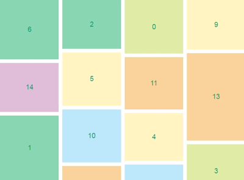

# vue-waterfall

[](https://travis-ci.org/MopTym/vue-waterfall)
[](https://www.npmjs.com/package/vue-waterfall)
[](LICENSE)

A waterfall layout component for Vue.js .

This branch is compatible with Vue 1 , [master (latest)](https://github.com/MopTym/vue-waterfall) is compatible with Vue 2 .

## Demo

- [Vertical line](http://app.moptym.com/vue-waterfall/demo/vertical-line.html)
- [Horizontal line](http://app.moptym.com/vue-waterfall/demo/horizontal-line.html)


## Installation

```shell
# install version 0.x.x
npm install --save vue-waterfall@0.*
```

## Usage

Vue-waterfall is a [UMD](https://github.com/umdjs/umd) module, which can be used as a module in both CommonJS and AMD modular environments. When in non-modular environment, `Waterfall` will be registered as a global variable.

### Import

#### ES6

```js
/* in xxx.vue */

import Waterfall from 'vue-waterfall/lib/waterfall'
import WaterfallSlot from 'vue-waterfall/lib/waterfall-slot'

/*
 * or use ES5 code (vue-waterfall.min.js) :
 * import { Waterfall, WaterfallSlot } from 'vue-waterfall'
 */

export default {
  ...
  components: {
    Waterfall,
    WaterfallSlot
  },
  ...
}
```

#### ES5

```js
var Vue = require('vue')
var Waterfall = require('vue-waterfall')

var YourComponent = Vue.extend({
  ...
  components: {
    'waterfall': Waterfall.waterfall,
    'waterfall-slot': Waterfall.waterfallSlot
  },
  ...
})
```

#### Browser

```html
<script src="path/to/vue/vue.min.js"></script>
<script src="path/to/vue-waterfall/vue-waterfall.min.js"></script>
```

```js
new Vue({
  ...
  components: {
    'waterfall': Waterfall.waterfall,
    'waterfall-slot': Waterfall.waterfallSlot
  },
  ...
})
```

### HTML structure

```html
<waterfall :line-gap="200" :watch="items">
  <!-- each component is wrapped by a waterfall slot -->
  <waterfall-slot v-for="item in items" :width="item.width" :height="item.height" :order="$index">
    <!--
      your component
    -->
  </waterfall-slot>
</waterfall>
```

## Props

### waterfall

<table>
    <thead>
        <tr>
            <th width="160">Name</th>
            <th width="160">Default</th>
            <th>Description</th>
        </tr>
    </thead>
    <tbody>
        <tr>
            <td>line</td>
            <td><code>v</code></td>
            <td><code>v</code> or <code>h</code> . Line direction.</td>
        </tr>
        <tr>
            <td>line-gap</td>
            <td>-</td>
            <td>Required. The standard space (px) between lines.</td>
        </tr>
        <tr>
            <td>min-line-gap</td>
            <td>= line-gap</td>
            <td>The minimal space between lines.</td>
        </tr>
        <tr>
            <td>max-line-gap</td>
            <td>= line-gap</td>
            <td>The maximal space between lines.</td>
        </tr>
        <tr>
            <td>single-max-width</td>
            <td>= max-line-gap</td>
            <td>The maximal width of slot which is single in horizontal direction.</td>
        </tr>
        <tr>
            <td>fixed-height</td>
            <td><code>false</code></td>
            <td>Fix slot height when line = <code>v</code> .</td>
        </tr>
        <tr>
            <td>align</td>
            <td><code>left</code></td>
            <td><code>left</code> or <code>right</code> or <code>center</code> . Alignment.</td>
        </tr>
        <tr>
            <td>auto-resize</td>
            <td><code>true</code></td>
            <td>Reflow when window size changes.</td>
        </tr>
        <tr>
            <td>interval</td>
            <td><code>200</code></td>
            <td>The minimal time interval (ms) between reflow actions.</td>
        </tr>
        <tr>
            <td>watch</td>
            <td><code>{}</code></td>
            <td>Watch something, reflow when it changes.</td>
        </tr>
    </tbody>
</table>


### waterfall-slot

<table>
    <thead>
        <tr>
            <th width="160">Name</th>
            <th width="160">Default</th>
            <th>Description</th>
        </tr>
    </thead>
    <tbody>
        <tr>
            <td>width</td>
            <td>-</td>
            <td>Required. The width of slot.</td>
        </tr>
        <tr>
            <td>height</td>
            <td>-</td>
            <td>Required. The height of slot.</td>
        </tr>
        <tr>
            <td>order</td>
            <td><code>0</code></td>
            <td>The order of slot, often be set to <code>$index</code> in <code>v-for</code> .</td>
        </tr>
        <tr>
            <td>move-class</td>
            <td>-</td>
            <td>Class for transition. see <a href="https://github.com/vuejs/vue-animated-list" target="_blank">vue-animated-list</a> .</td>
        </tr>
    </tbody>
</table>

## Transition

Inspired by [vue-animated-list](https://github.com/vuejs/vue-animated-list) , vue-waterfall supports moving elements with `translate` in transition, click on the [demo](http://app.moptym.com/vue-waterfall/demo/vertical-line.html) page to see it.



## Events

```js
ON ( 'wf-reflow' ) { /* use 'wf-reflow' event to trigger reflow action */
  reflow
}
```

```js
AFTER ( reflow ) {
  broadcast 'wf-reflowed'
  dispatch 'wf-reflowed'
}
```

## Reactivity

```js
WHEN ( layout property changes ) { /* line, line-gap, etc. */
  reflow
}
```

```js
WHEN ( slot changes ) { /* add, remove, etc. */
  reflow
}
```

## License

Released under the [MIT](LICENSE) License.
